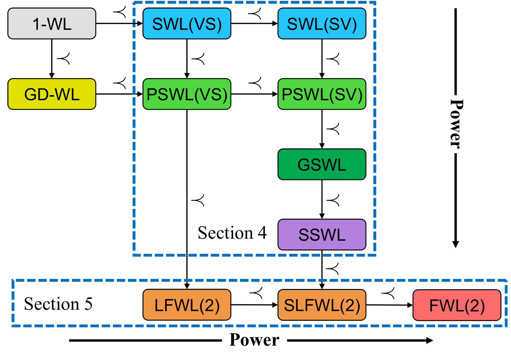

# SWL

The official code of the paper **[A Complete Expressiveness Hierarchy for Subgraph GNNs via Subgraph Weisfeiler-Lehman Tests](https://arxiv.org/pdf/2302.07090.pdf)**.



## Training Logs

Each log file in the `logs` folder contains the training result of a model configuration. In each file, the i-th row contains metrics at the i-th training epoch, typically, the learning rate, training loss, validation MAE, and test MAE.

### ZINC

Each file is named by the corresponding dataset (ZINC-subset or ZINC-full), model string, batch size, distance encoding hyper-parameter, and random seed, with the form `logs/ZINC/<subset>.<model>.<batch size>.<max distance>.<seed>.txt`. We also rerun the baseline [SUN architecture](https://arxiv.org/abs/2206.11140) on the ZINC-full dataset. The logs are saved in `logs/ZINC/<policy>.<model>.<seed>.txt`.

### Counting Substructure

Each file is named by the model string, task name, network hidden size, batch size, learning rate, epochs, distance encoding hyper-parameter, and random seed, with the form `logs/substructure/<model>-GraphCount-<task>-<hidden size>-<batch size>-<learning rate>-<epochs>-<max distance>-<seed>.txt`. We also rerun the baseline [SUN architecture](https://arxiv.org/abs/2206.11140) for counting 5 cycle and 6-cycle. The logs are saved in `logs/substructure/<policy>-<hop k>-<task>.csv`.

### Ogbg-molhiv

All log files are in the `logs/ogbg-molhiv` folder.

## Acknowledgement

Our code is motivated by the code of [SUN](https://github.com/beabevi/sun).

## History

- 02/13: initial commit.
- 02/15: add training logs on ZINC-subset and ZINC-full datasets.
- 03/21: add training logs on coutning substructure dataset and ogbg-molhiv dataset.

## Citation

```
@article{zhang2023complete,
  author = {Zhang, Bohang and Feng, Guhao and Du, Yiheng and He, Di and Wang, Liwei},
  title = {A Complete Expressiveness Hierarchy for Subgraph GNNs via Subgraph Weisfeiler-Lehman Tests},
  journal = {arXiv preprint arXiv:2302.07090},
  year = {2023},
}
```